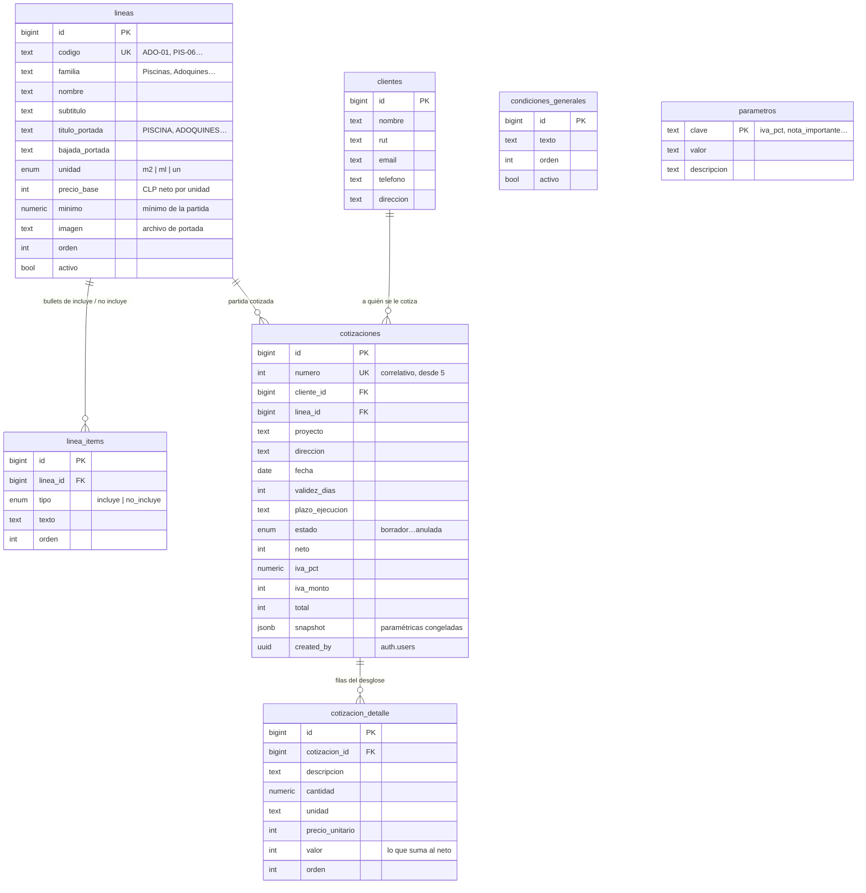

# Cotizador — funcionalidades y modelo de datos

Qué hace la herramienta y cómo cada funcionalidad se apoya en las tablas.
Documento de referencia para quien tenga que mantenerla o extenderla.

- **Dónde vive:** `terraconcept.cl/cotizador/` (sin link desde el sitio público).
- **Código:** `cotizador/` — `index.html`, `app.js`, `ui.css`, `documento.css`.
- **Base de datos:** Supabase / Postgres 17. Esquema en `supabase/*.sql`.

---

## 1. El modelo en una frase

Hay dos mundos separados a propósito:

**Paramétricas** — `lineas`, `linea_items`, `condiciones_generales`,
`parametros`. Es el tarifario y los textos del documento. Cambian poco y los
edita la empresa.

**Operacionales** — `clientes`, `cotizaciones`, `cotizacion_detalle`. Es lo que
se genera todos los días.

El puente entre ambos es `cotizaciones.snapshot`: una copia congelada de las
paramétricas al momento de emitir. Por eso subir el tarifario mañana no reescribe
las cotizaciones de ayer.



Tres enums: `unidad_medida` (`m2`, `ml`, `un`), `tipo_item` (`incluye`,
`no_incluye`) y `estado_cotizacion` (`borrador`, `enviada`, `aceptada`,
`rechazada`, `anulada`).

---

## 2. Funcionalidad por funcionalidad

### 2.1 Entrar a la herramienta

Login con correo y contraseña contra Supabase Auth. Sin sesión no se carga nada:
la RLS rechaza toda lectura, así que la pantalla de login no es cosmética.

| | |
|---|---|
| **Tablas** | `auth.users` (gestionada por Supabase) |
| **Escribe** | nada |
| **Código** | `app.js` → `signInWithPassword`, `entrar()` |

Los usuarios se crean a mano desde el panel; el registro público está
deshabilitado. Toda tabla exige `auth.uid() is not null` en sus 4 políticas, y
además el rol `anon` tiene los privilegios revocados — dos cierres, no uno.

`cotizaciones.created_by` guarda quién la creó (`default auth.uid()`). Hoy no se
usa para filtrar: el equipo comparte el mismo pool. Es el gancho por si algún día
se quiere que cada vendedor vea sólo lo suyo.

---

### 2.2 Elegir la partida del tarifario

Un desplegable con las 12 partidas. Al elegir una, la app muestra su precio,
unidad y mínimo, y precarga el nombre del proyecto.

| | |
|---|---|
| **Lee** | `lineas` (`activo = true`, por `orden`) y `linea_items` |
| **Escribe** | nada |
| **Código** | `cargarCatalogo()`, listener de `#f-linea` |

Las 12 filas salen de las 11 partidas del tarifario: la partida 5 —pastelones por
unidad— se abre en dos, `PAS-05A` y `PAS-05B`, porque tiene dos precios según el
formato del pastelón.

`lineas.unidad` manda sobre toda la interfaz: cambia el rótulo del campo
cantidad (m², ml o unidades), el texto del mínimo y la unidad que se guarda en el
desglose.

`lineas.imagen` apunta a `images/cotizador/`. Hay 4 fotos para 12 partidas
porque el mapeo es **por familia**: piscina, pastelones, adoquines, fachaletas.
Es una columna por partida, así que se puede diferenciar más adelante sin tocar
código.

---

### 2.3 Validar el mínimo

Si la cantidad queda bajo el mínimo de la partida, aparece una alerta.

| | |
|---|---|
| **Lee** | `lineas.minimo`, `lineas.unidad` |
| **Código** | `validarMinimo()` |

**Avisa, no bloquea.** El mínimo es una regla comercial, no una restricción de
integridad, y el vendedor puede tener motivos para saltárselo. Por lo mismo no
hay `check` en la base de datos.

---

### 2.4 Armar el desglose

La tabla "DESGLOSE DE INSTALACIÓN" del PDF. La app propone una primera fila desde
el tarifario (`cantidad × precio_base`) y desde ahí el usuario agrega, edita,
reordena y borra filas libres.

| | |
|---|---|
| **Lee** | `lineas.precio_base`, `lineas.unidad` |
| **Escribe** | `cotizacion_detalle` |
| **Código** | `proponerDetalle()`, `pintarFilas()` |

**Por qué es mixto y no calculado.** En la cotización de referencia el total de
$4.000.000 no sale de multiplicar los $35.000/ml del tarifario: las filas son
"Radier perimetral en hormigón", "Mano de obra especializada", "Logística y
traslado interno". Un desglose puramente automático no reproduce el formato que
la empresa usa.

La fila propuesta lleva una marca interna `_auto`. En cuanto el usuario edita
cualquiera de sus campos, la marca se cae y la app deja de pisarla al recalcular.

`cotizacion_detalle.valor` es la única columna que suma al neto. `cantidad`,
`unidad` y `precio_unitario` son informativas y pueden ir nulas: una fila como
"Logística y traslado interno" no tiene cantidad ni precio unitario que tengan
sentido.

---

### 2.5 Calcular totales

| | |
|---|---|
| **Lee** | `cotizacion_detalle.valor`, `parametros.iva_pct` |
| **Escribe** | `cotizaciones.neto`, `.iva_pct`, `.iva_monto`, `.total` |
| **Código** | `totales()`, `recalcular()` |

```
neto  = suma de cotizacion_detalle.valor
iva   = round(neto × iva_pct / 100)
total = neto + iva
```

El IVA sale de `parametros`, no está hardcodeado: si cambia la tasa, se edita una
fila de la base.

Los tres montos se **guardan** en la cotización en vez de recalcularse al leer.
Es duplicación a propósito: una cotización emitida tiene que poder mostrar los
mismos montos aunque después cambien el IVA o el detalle. El listado, además,
puede mostrar el total sin tener que leer el desglose completo de cada fila.

Todo se guarda en enteros CLP. El peso chileno no tiene decimales y `iva_pct` es
lo único `numeric`.

---

### 2.6 Ver el documento en vivo

Panel derecho: las 3 páginas del PDF, redibujadas con cada tecla y escaladas para
que quepa la hoja.

| | |
|---|---|
| **Lee** | `lineas`, `linea_items`, `parametros` |
| **Código** | `render()`, `paginaPortada()`, `paginaAlcance()`, `paginaPresupuesto()` |

Qué alimenta cada página:

| Página | Contenido | De dónde sale |
|---|---|---|
| 1 · Portada | Foto, `INSTALACIÓN DE {título}`, bajada | `lineas.imagen`, `.titulo_portada`, `.bajada_portada` |
| | Titular, párrafo y 4 atributos | `parametros.portada_*`, `parametros.atributo_N_*` |
| 2 · Alcance | ¿Qué incluye? / ¿Qué no incluye? | `linea_items` filtrado por `tipo` |
| | Nota al pie | `parametros.nota_alcance` |
| 3 · Presupuesto | Ficha del cliente y el proyecto | `clientes`, `cotizaciones` |
| | Tabla de desglose | `cotizacion_detalle` |
| | Neto / IVA / Total | `cotizaciones.neto`, `.iva_monto`, `.total` |
| | Avisos y cierre | `parametros.nota_visita_tecnica`, `.nota_importante`, `.cierre_documento` |

Casi todo el texto fijo del documento vive en `parametros`. Marketing puede
cambiar la redacción sin que nadie toque código.

**Los íconos de la página 2 son uno solo** (✓ para incluye, ✕ para no incluye),
no uno distinto por línea como en el diseño de referencia. Los bullets salen de
la base y son texto libre: no hay forma de derivar un ícono específico de un
texto arbitrario. Si se quisiera, habría que agregar una columna `icono` en
`linea_items` y asignar los 179 a mano.

---

### 2.7 Guardar

| | |
|---|---|
| **Escribe** | `clientes`, `cotizaciones`, `cotizacion_detalle` |
| **Código** | `guardar()` |

En orden:

1. **Cliente** — si el nombre coincide con uno existente se reutiliza su `id`; si
   no, se crea. Evita duplicados por escribir dos veces el mismo nombre.
2. **Snapshot** — se arma el jsonb con la partida, sus bullets, las condiciones
   generales y todos los parámetros.
3. **Cabecera** — `insert` si es nueva, `update` si ya tenía `id`. El correlativo
   lo pone la base.
4. **Detalle** — en edición se borran las filas y se reinsertan; es más simple y
   más seguro que reconciliar altas, bajas y cambios de orden.

#### El correlativo

`cotizaciones.numero` tiene `default nextval('cotizacion_numero_seq')`, secuencia
que arranca en 5. Se muestra con relleno a 5 dígitos: `00005`.

**Lo asigna la base, nunca el navegador.** Si lo calculara el cliente con un
`max(numero) + 1`, dos personas guardando al mismo tiempo obtendrían el mismo
número.

**Se asigna al guardar, no al abrir el formulario.** Mientras se arma, el
documento muestra `—`. Si se reservara al abrir, cada borrador abandonado dejaría
un hueco en la numeración.

#### El snapshot

`cotizaciones.snapshot` (jsonb) guarda:

```json
{
  "linea":        { "codigo": "PIS-06", "nombre": "…", "precio_base": 35000, … },
  "incluye":      ["Replanteo.", "Adhesivo DA.", …],
  "no_incluye":   ["Suministro de bordes de piscina.", …],
  "condiciones":  ["Todos los valores corresponden a mano de obra…", …],
  "parametros":   { "iva_pct": "19", "nota_importante": "…", … },
  "cantidad":     40,
  "congelado_en": "2026-08-07T…"
}
```

Sin esto, subir el tarifario reescribiría el pasado: una cotización enviada en
marzo se reimprimiría en agosto con los precios y textos de agosto. Con el
snapshot, cada cotización conserva el documento tal como se envió.

También sirve de respaldo: `snapshot.cantidad` es lo que permite restaurar el
campo cantidad al reabrir una cotización, dato que no tiene columna propia.

---

### 2.8 Listado, búsqueda y filtro

| | |
|---|---|
| **Lee** | `cotizaciones` + `clientes` (join), por `numero` descendente |
| **Código** | `cargarListado()`, `pintarListado()` |

La consulta trae sólo las columnas de la grilla — nunca el `snapshot`, que es el
campo pesado. La búsqueda y el filtro por estado se resuelven **en memoria** sobre
lo ya cargado: con el volumen esperado (decenas o cientos de cotizaciones) es
instantáneo y evita un viaje al servidor por cada tecla. Si algún día crece,
habrá que pasarlo a filtros del lado del servidor con paginación.

---

### 2.9 Abrir, duplicar y anular

| | |
|---|---|
| **Lee** | `cotizaciones` + `clientes`, `cotizacion_detalle` |
| **Escribe** | según la acción |
| **Código** | `abrirCotizacion()`, `anularCotizacion()`, `volcarAlFormulario()` |

**Abrir** carga la cotización completa en el editor conservando `id` y `numero`.
Al guardar hace `update`: no consume número nuevo.

**Duplicar** carga lo mismo pero suelta `id` y `numero`, pone la fecha de hoy y
el estado en `borrador`. Al guardar, la base asigna el siguiente correlativo. El
cliente **se reutiliza**, no se duplica.

**Anular** cambia `estado` a `anulada`. **Nunca se borra una cotización**: el
correlativo quedaría con huecos, que es justo lo que el correlativo existe para
evitar. Por eso las FK de `cotizaciones` hacia `clientes` y `lineas` son
`on delete restrict` — la base tampoco deja borrar un cliente o una partida que
tenga cotizaciones colgando.

`cotizacion_detalle` sí es `on delete cascade`: las filas del desglose no tienen
sentido sin su cotización.

---

### 2.10 Descargar el PDF

| | |
|---|---|
| **Lee** | lo que ya está en pantalla |
| **Escribe** | nada |
| **Código** | `documento.css` → `@media print`, `@page` |

El botón dispara `window.print()`. El CSS de impresión oculta barra, panel y
listado, y anula el escalado de la vista previa. Verificado: salen 3 hojas A4
exactas sin una sola cadena de la interfaz.

Se eligió CSS de impresión sobre una librería tipo `html2pdf.js` porque conserva
la fidelidad exacta del diseño, deja el texto seleccionable, pesa mucho menos y
no agrega dependencias. El costo es que el usuario pasa por el diálogo del
navegador y elige "Guardar como PDF".

El nombre sugerido del archivo sale del `<title>`, que la app arma como
`Cotizacion-00005-Kirk-Donoso`.

**Calibración de la página 2:** el alto de fila está ajustado contra la partida
más larga del tarifario —Adoquines, 10 incluye + 8 no incluye— para que las 18
filas más la nota al pie quepan en una sola hoja. Con eso las 12 partidas caben
en 3 páginas. Si se toca ese espaciado, hay que revalidar ese caso.

---

## 3. Mapa rápido: tabla → quién la usa

| Tabla | La leen | La escriben |
|---|---|---|
| `lineas` | selector de partidas, portada, propuesta de desglose | seed |
| `linea_items` | página 2 del documento | seed |
| `condiciones_generales` | snapshot | seed |
| `parametros` | cálculo del IVA y todos los textos del documento | seed |
| `clientes` | ficha del documento, listado, autocompletado | guardar |
| `cotizaciones` | listado, editor, documento | guardar, anular |
| `cotizacion_detalle` | tabla de desglose, cálculo del neto | guardar |

---

## 4. Cambios frecuentes y dónde se hacen

| Qué cambiar | Dónde |
|---|---|
| Precio o mínimo de una partida | `lineas.precio_base`, `.minimo` |
| Un bullet de incluye / no incluye | `linea_items.texto` |
| Tasa de IVA | `parametros` → `iva_pct` |
| Teléfono, correo o web del pie | `parametros` → `empresa_*` |
| Textos de la portada o los avisos | `parametros` → `portada_*`, `nota_*`, `atributo_*` |
| Condiciones generales | `condiciones_generales` |
| Foto de portada de una partida | `lineas.imagen` + archivo en `images/cotizador/` |
| Agregar una partida nueva | fila en `lineas` + sus bullets en `linea_items` |
| Dar de baja una partida | `lineas.activo = false` (no borrar: hay cotizaciones apuntando) |

Nada de esto requiere tocar código ni volver a desplegar. Los cambios en
paramétricas **no afectan** a las cotizaciones ya emitidas, gracias al snapshot.

---

## 5. Lo que no hace

Envío de la cotización por correo desde la app · firma electrónica · integración
con SII o facturación · conversión automática UF/CLP (el valor de la visita
técnica se muestra en UF como texto) · portal para que el cliente vea su
cotización · roles diferenciados: hoy cualquier usuario autenticado ve y edita
todo.
